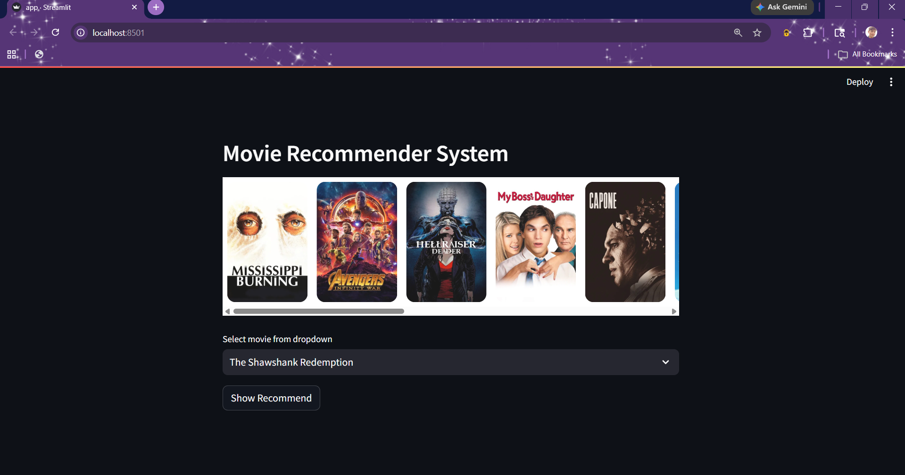
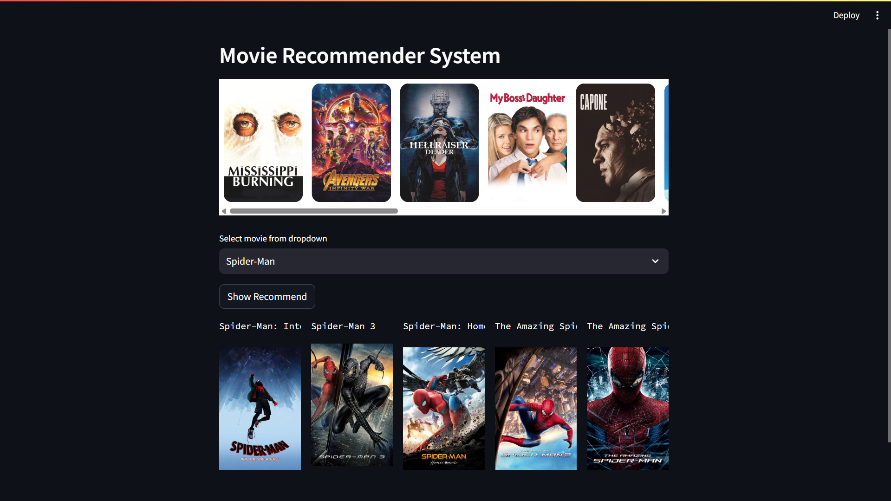

# 🎬 Movie Recommendation System


---

## 📌 Description

This project is a **Movie Recommendation System** built using Machine Learning and deployed using **Streamlit**.

It recommends movies based on similarity scores and displays movie posters using the TMDB API.

---

## 🚀 Features

* 🎯 Recommend top 5 similar movies
* 🎬 Movie selection dropdown
* 🖼️ Displays movie posters
* ⚡ Fast recommendation using similarity matrix
* 🌐 Interactive web interface using Streamlit

---

## 🧠 How It Works

* Uses a **precomputed similarity matrix**
* Finds similar movies based on selected movie
* Fetches posters using TMDB API 
* Displays results in a clean UI

---

## 🛠️ Tech Stack

* Python 🐍
* Pandas
* Scikit-learn
* Streamlit
* Pickle
* TMDB API

---

## 📂 Project Structure

```
Movie-Recommender-System/
│── README.md
│── app.py
│── frontend.7z
│── main.jpynb
│── requirements.txt
│── screenshot1.png
│── screenshot2.png
│── top10K-TMDB-movies.csv
```

---

## ⚙️ Installation & Setup

1. Clone the repository:

```bash
git clone https://github.com/your-username/Movie-Recommender-System.git
cd movie_recommendation_system
```

2. Install dependencies:

```bash
pip install -r requirements.txt
```

3. Run the app:

```bash
streamlit run app.py
```

---

## 📷 Screenshot




---

## 🎯 Future Improvements

* Add user-based recommendations
* Deploy on cloud (Streamlit Cloud / AWS)
* Improve UI design
* Add search functionality

---

## 👨‍💻 Author

**Mamun Reja**
🎓 B.Tech AI & ML Student

---

## ⭐ Support

If you like this project:

* ⭐ Star the repo
* 🍴 Fork it
* 📢 Share it

---

## 📜 License

This project is for educational purposes only.

---


